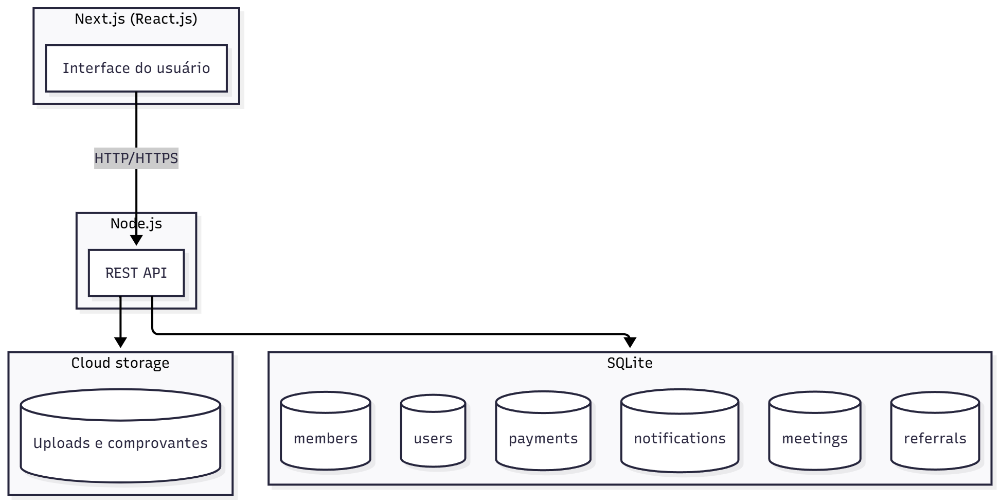

# Arquitetura - Plataforma de Gestão para Grupos de Networking

**Autor:** Pedro Henrique Arantes Martins

A plataforma tem como objetivo principal digitalizar e otimizar gestão de grupos de networking, substituindo planilhas e controles manuais por um sistema integrado e automatizado. Dessa maneira, suas principais funções são:

- Gestão de membros.
  - Formulários públicos com intenção de participação
  - Área de gestão para os administradores aprovarem ou recusarem essas intenções.
  - Formulários de cadastro completo para os membros aceitos pelos administradores.
- Comunicação e engajamento
  - Área de avisos e comunicados para os membros
  - Controlar presença em reuniões (sistema de check-in).
- Geração de negócios
  - Sistema de indicações e referências de negócios entre os membros.
  - Avaliação e acompanhamento do status das indicações (ex: Enviada, Em negociação, Fechada).
  - Registro de agradecimentos públicos por negócios fechados.
- Acompanhamento e performance:
  - Controle de reuniões 1-on-1 entre os membros.
  - Dashboards de desempenho individual e do grupo.
  - Relatórios por período (semanal, mensal, acumulado).
- Financeiro
  - Módulo de controle de mensalidades (geração de mensalidades e status de pagamento).

## Diagrama da arquitetura



- Frontend: Next.js -> Interação do usuário com performance, SEO e escalabilidade
- Backend: Node.js -> Mantém padrão de linguagem para projeto completo, tipagem, organização.
- Banco de dados: SQLite -> Praticidade, não necessita servidor rodando para o banco de dados.
- Storage: Cloud storage -> Permite armazenamento de arquivos em nuvem com fácil acesso e gerenciamento

## Modelagem de dados

A escolha de um banco de dados SQL facilita consultas complexas e relatórios por ter um modelo relacional, logo para um projeto escalável desse padrão, é a melhor recomendação.

| Tabela        | Campos                                                                                                                                                                                                                                                                                                                                                                    | Descrição                                                                                                                                       |
| ------------- | ------------------------------------------------------------------------------------------------------------------------------------------------------------------------------------------------------------------------------------------------------------------------------------------------------------------------------------------------------------------------- | ----------------------------------------------------------------------------------------------------------------------------------------------- |
| users         | id (primary key, UUID, string), created_at (date), updated_at (date), role (string), permissions (string list), email (string), password (string), active (boolean), admitted (boolean), name (string), company (string), purpose (string), referrals (integer), token (UUID, string), gender (string), city (string), state (string), country (string), birthdate (date) | Usuários do sistema, administradores e membros com controle de acesso e admissão.                                                               |
| notifications | id (primary key, UUID, string), created_at (date), updated_at (date), expires_at (date), title (string), description (string), role (string), active (boolean)                                                                                                                                                                                                            | Notificações do sistema, com controle de expiração, ativa ou inativa, e usuários que podem vê-la.                                               |
| payments      | id (primary key, UUID, string), created_at (date), updated_at (date), status (string), user_id (foreign key -> users/id), value (integer), receipt_url (string)                                                                                                                                                                                                           | Gestão de pagamentos com status, usuário referente e url do comprovante                                                                         |
| meetings      | id (primary key, UUID, string), created_at (date), updated_at (date), starts_at (date), ends_at (date), title (string), description (string), role (string), invited_users (UUID, string list), checkins (UUID, string list), type (string)                                                                                                                               | Reuniões com controle de checkins com id dos usuários, tipo (1-on-1 ou geral), usuários convidados, datas e horário de início e fim.            |
| referrals     | id (primary key, UUID, string), created_at (date), updated_at (date), expires_at (date), from (foreign key -> users/id), to (foreign key -> users/id), status (string), thank (string)                                                                                                                                                                                    | Indicações com chave estrangeira de usuário que convidou e usuário que foi convidado, registro de "obrigado" no convite, status das indicações. |

Relacionamentos:

- users 1-N referrals
- referrals 1-1 users
- meetings 1-N users
- payments 1-1 users
- notifications 1-N users

## Estrutura do frontend

Para manter uma organização e componentização que tornem o projeto modular e com código reutilizável, a estrutura do frontend se baseia em uma arquitetura em camadas DDD (Domain-driven design), dividindo majoritariamente em Domain, Application e Infrastructure:

```plaintext
/client                Raiz do frontend
│
├── /src               Código fonte
│   │
│   ├── /app               Rotas e actions
│   │   ├── /server-actions        Requisições para a API do backend
│   │   │   ├── /users                Requisições relacionadas a usuário
│   │   │   ├── /notifications        ...
│   │   │   ├── /payments             ...
│   │   │   ├── /referrals            ...
│   │   │   └── /meetings             ...
│   │   └── /routers              Rotas e páginas
│   │
│   ├── /presentation        Arquivos relacionados à UI
│   │   ├── /ui                 Componentes gerais de UI
│   │   │   ├── /atoms              Componentes pequenos (ex: button, typography)
│   │   │   ├── /molecules          Componentes médios (ex: modal, section)
│   │   │   └── /organisms          Componentes grandes (ex: form, table)
│   │   └── /utils               Helpers de UI
│   │
│   ├── /domain              Domain do projeto com entidades e enums
│   │   ├── /entities
│   │   └── /enums
│   │
│   ├── /application         Camada de application (DTOs e casos de uso)
│   │   ├── /dtos                DTOs das requests
│   │   │   ├── /user
│   │   │   │   ├── /requests
│   │   │   │   └── /responses
│   │   │   ├── /notifications       ...
│   │   │   ├── /payments            ...
│   │   │   ├── /referrals           ...
│   │   │   └── /meetings            ...
│   │
│   ├── /infrastructure      Implementação concreta de APIs, adapters e configs
│   │   ├── /api
│   │   ├── /adapters
│   │   └── /config
│   │
│   └── /shared             Helpers, hooks, utils compartilhados entre camadas
│       ├── /helpers
│       ├── /hooks
│       └── /utils
│
└── /public              Assets públicos
```

## Definição da API

A estrutura da API será RESTful com autenticação via JWT, a divisão ocorrerá por módulos relacionados diretamente às tabelas.

### Usuários

#### **POST** `/users/admin`

Criação de um novo usuário **administrador**.

**Request**

```json
{
  "email": "test@mail.com",
  "password": "password123"
}
```

**Response**

```json
{
  "id": 1,
  "status": "ACTIVE",
  "role": "ADMIN"
}
```

### Notificações

#### **GET** `/notifications/member`

Retorna lista de notificações exclusivas aos membros.

**Request**

```json
{
  "active": true
}
```

**Response**

```json
{
  "notifications": [
    {
      "id": "32452810-effd-4325-b892-b7947d8f2e21",
      "title": "Notification title",
      "description": "Notification description"
    }
  ],
  "page": 1,
  "thisPage": 10,
  "totalPages": 5,
  "total": 50,
  "hasNext": true
}
```

### Financeiro

#### **PUT** `/payments?payment_id=614a74b8-d2b9-487f-86a4-8dc104d770c2`

Atualiza pagamento de usuário.

**Request**

```json
{
  "status": "cancelled"
}
```

**Response**

```json
{
  "user_id": "a178a493-861e-4667-a323-0fdd81375be4",
  "status": "cancelled",
  "value": 10.0
}
```

## Segurança

- Hash de senhas com bcrypt
- JWT + Refresh tokens
- Rate limiting para evitar brute force
- HTTPS e CORS configurados
- Permissions para limitar funções dos usuários

## Fluxo de desenvolvimento

1.  Planejamento de arquitetura
    - Levantamento de requisitos
    - Elaboração deste documento
2.  Configuração de monorepo
    - Frontend e backend
3.  Implementação de backend base e testes
    - Node + Express + SQLite
    - Jest para testes
4.  Desenvolvimento do frontend e testes
    - Next.js + Tailwind + shadcn
    - Jest para testes
5.  Entrega do projeto modularizado com deploy
    - Frontend: Vercel
    - Backend: Render/AWS

## Tecnologias

Para elaboração do projeto, as seguintes tecnologias são utilizadas:

| Camada         | Tecnologias                                 |
| -------------- | ------------------------------------------- |
| Frontend       | Next.js, TypeScript, Tailwind, shadcn, Jest |
| Backend        | Node.js, TypeScript, Express, Jest          |
| Banco de dados | SQLite                                      |
| Autenticação   | JWT                                         |
| Deploy         | Vercel (frontend), Render/AWS (backend)     |
